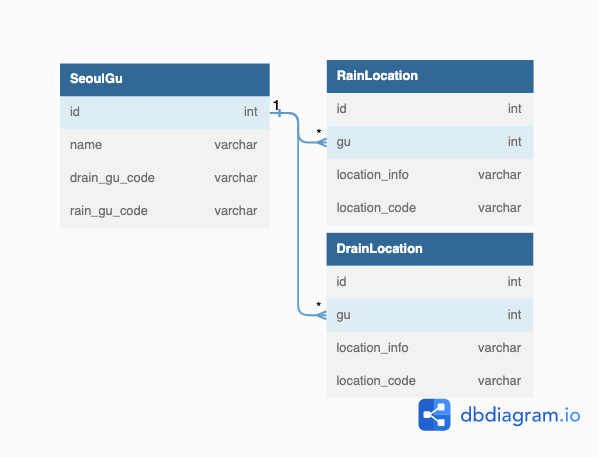

# 04_LAB_Q_jihoon

## 📝 요구사항

- open API 2종(서울시 하수관 수위 데이터, 서울시 강우량 데이터)을 활용
- GUBN_NAME(하수관 구청식별 코드) 과 GU_NAME(강우량 구청식별 코드) 등을 파라메터로 입력받아 결합된 데이터를 리턴
- 데이터는 JSON으로 전달
### 🌧 서울시 강우량 open API 응답 sample
http://openapi.seoul.go.kr:8088/sample/json/ListRainfallService/1/2/%EC%A2%85%EB%A1%9C%EA%B5%AC
path variavle : /{index start}/{index end}/{GU_NAME}
~~~
{
    ListRainfallService: {
        list_total_count: 13646,
        RESULT: {
            CODE: "INFO-000",
            MESSAGE: "정상 처리되었습니다"
            },
        row: [
            {
                RAINGAUGE_CODE: 1002,
                RAINGAUGE_NAME: "부암동",
                GU_CODE: 110,
                GU_NAME: "종로구",
                RAINFALL10: "0",
                RECEIVE_TIME: "2022-11-18 00:19"
                },
            {
                RAINGAUGE_CODE: 1001,
                RAINGAUGE_NAME: "종로구청",
                GU_CODE: 110,
                GU_NAME: "종로구",
                RAINFALL10: "0",
                RECEIVE_TIME: "2022-11-18 00:19"
            }
        ]
    }
}
~~~
### 💧 서울시 하수관 수위 open API 응답 sample
http://openapi.seoul.go.kr:8088/sample/json/DrainpipeMonitoringInfo/1/2/01/2022111700/2022111700
path variable : /{index start}/{index end}/{GUBN_CODE}/{YYYYMMDDHH}/{YYYYMMDDHH}
~~~
{
    DrainpipeMonitoringInfo: {
        list_total_count: 240,
        RESULT: {
            CODE: "INFO-000",
            MESSAGE: "정상 처리되었습니다"
            },
        row: [
            {
                IDN: "01-0004",
                GUBN: "01",
                GUBN_NAM: "종로",
                MEA_YMD: "2022-11-17 00:00:18.0",
                MEA_WAL: 0.11,
                SIG_STA: "통신양호",
                REMARK: "종로구 세종대로178 뒤 맨홀(KT광화문사옥뒤 자전거보관소앞 종로1길, 미대사관~종로소방서 남측, 중학천 하스박스)"
            },
            {
                IDN: "01-0003",
                GUBN: "01",
                GUBN_NAM: "종로",
                MEA_YMD: "2022-11-17 00:00:18.0",
                MEA_WAL: 0.11,
                SIG_STA: "통신양호",
                REMARK: "종로구 자하문로 21 앞 맨홀(영해빌딩앞코너 측구측, 백운동천 하수박스)"
            }
        ]
    }
}
~~~

## 📐 설계방향

### 🔧 사용 기술
- **Back-End** : Python, Django, Django REST framework, Pandas
- **Database** : SQLite
- **Lint** : Black
- **ETC** : Git, Github

### ✍🏻 개요 
1. 구청별 식별자(GUBN_CODE, GU_NAME)를 담는 테이블 필요    
2. 해당 구청의 데이터별 관측소 정보를 가진 테이블 필요    
3. 요청시 1번에 해당하는 DB에 구청테이블의 각 구청별 id를 통해서 path variable로 조회 (ex. /some_domain/seoul/\<int:gu_id\>/)
4. 1,2번에 해당하는 내용은 batch 앱을 따로 생성해 django-admin custom command로 csv data를 해당 테이블에 삽입  

### ⚙️ ERD

### 👈🏻 API Endpoint
|INDEX|URI|METHOD|DESC|
|:---:|:---|:---:|:---:|
|1|/seoul/|GET|서울시 구청리스트 조회|
|2|/seoul/\<int:gu_id\>/|GET|구청별 요청 데이터 조회|